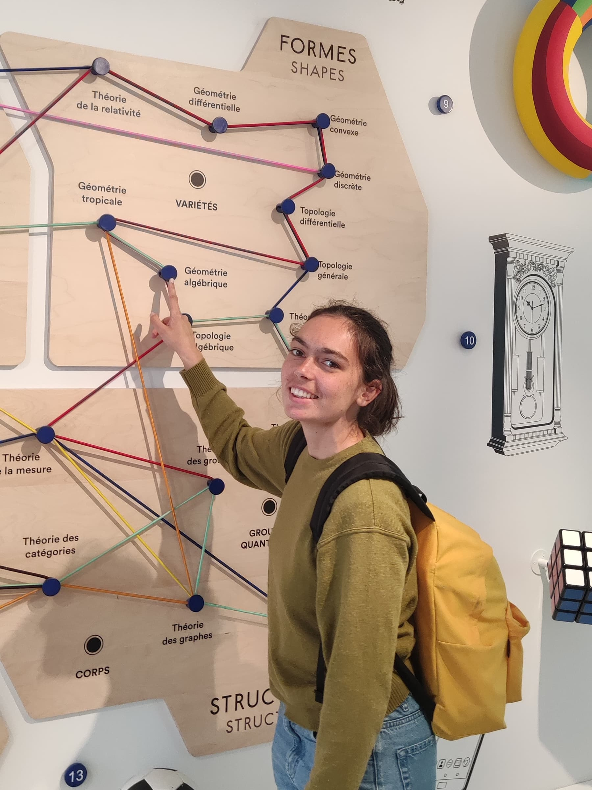

# Elsa Maneval

  

    
Welcome to my webpage!

    

      Since September 2024, I am a <strong>PhD student in Mathematics</strong>
      at École Polytechnique Fédérale de Lausanne (EPFL).
    

    

      I work under the supervision of <strong>Dimitri Wyss</strong> in the <a href="https://www.epfl.ch/labs/arg/arg-chair-of-arithmetic-geometry/members/" target="_blank">Chair of Arithmetic Geometry</a>.
    

    

      Previously, I studied at <strong>École Normale Supérieure Ulm</strong> and at <strong>Sorbonne Université</strong> in Paris.
    

    

     My field of research is enumerative geometry. Precisely, I am interested in the use of <strong> \(p\)-adic</strong> and
      <strong>motivic integration</strong> techniques on
      <strong>moduli spaces of Higgs bundles</strong> and their
      <strong>mirror symmetry</strong> features. 
    

   
  

  <figure style="margin: 0; text-align: center;">
    
  </figure>

---

## Research

- *Non-archimedean topological mirror symmetry for $$ \mathrm{SL}_n$$ and $$\mathrm{PGL}_n$$ Higgs bundles*, [arXiv:2507.02588](https://arxiv.org/abs/2507.02588).
  
---

## Upcoming Talks & Travel

- [Algebra, Geometry and Topology Seminar](https://algebraic-geometry.pages.ist.ac.at/), IST Austria, March 5, 2026

- Workshop [*Duality for Higgs bundles*](https://sites.google.com/view/higgs26/), University of Bonn, May 26, 2026
  
  invited talk
  
- Workshop [*Unifying geometric perspectives on the Hitchin moduli space*](https://bernoulli.epfl.ch/programs/unifying-geometric-perspectives-on-the-hitchin-moduli-space/), Bernoulli Center EPFL, 10-14 August 2026

  invited talk

---

## Past Talks & Travel

- Winter School [*Motives in Montpellier*](https://imag.umontpellier.fr/~tomic/school2026/), IMAG, Université de Montpellier, 19-23 January 2026

  contributed talk : *Towards an integral-theoretic definition of motivic BPS invariants* <a href="talk-Montpellier.pdf" target="_blank"> Notes </a>

- [Séminaire Arithmétique et Géométrie Algébrique](https://irma.math.unistra.fr/seminaires/seminaire-arithmetique-et-geometrie-algebrique.html), Strasbourg, 18 December 2025

  invited talk : *Higgs bundles and mirror symmetry*
  
- Conference [Rencontre ANR DAG Arts](https://sites.google.com/view/dag-arts/%C3%A9v%C3%A9nements/1%C3%A8re-rencontre-anr), Angers, 29-31 October 2025

   invited talk : *Higgs bundles and mirror symmetry*
  
- Conference [Current trends in Calabi-Yau moduli](https://irma.math.unistra.fr/~lfu/Activities/Conference-Moduli-Strasbourg.html), Strasbourg, 10-13 June 2025

  poster : *Higgs bundles and mirror symmetry*

- Conference [Women in Mathematics](https://www.epfl.ch/schools/sb/research/math/events-and-seminars/conference-women-in-mathematics/), EPFL, 15-16 May 2025
    
  contributed talk : *Arithmetic methods in enumerative geometry*
  
- Conference [Combinatorial Algebraic Geometry](https://sites.google.com/view/coalggeohug/home), Frankfurt, 31 March-4 April 2025

  short talk : *Higgs bundles and mirror symmetry*

---

## Teaching

- Fall 2025 : [*Topology IV.a, Cohomology Rings*](https://edu.epfl.ch/coursebook/en/topology-iv-a-cohomology-rings-MATH-506), Master, lectured by Jerôme Scherer, EPFL (Teaching Assistant)
- Spring 2025 : [*Topology II, fundamental groups*](https://edu.epfl.ch/coursebook/en/topology-ii-fundamental-groups-MATH-225), Bachelor 2, lectured by Dimitri Wyss, EPFL (Principal Teaching Assistant)
- Fall 2024 : [*Algèbre I, Structures fondamentales*](https://edu.epfl.ch/coursebook/fr/algebre-i-structures-fondamentales-MATH-113), Bachelor 1, lectured by Dimitri Wyss, EPFL (Principal Teaching Assistant)
- Spring 2024 : [*Algebraic Geometry I, curves*](https://edu.epfl.ch/coursebook/en/algebraic-geometry-i-curves-MATH-328), Bachelor 3, lectured by Dimitri Wyss, EPFL (Solution sheets writing)
- Fall 2023 :  [*Algèbre I, Structures fondamentales*](https://edu.epfl.ch/coursebook/fr/algebre-i-structures-fondamentales-MATH-113), Bachelor 1, lectured by Dimitri Wyss, EPFL (Teaching Assistant)
- 2020-2021 : Khôlles MP★ , Lycée Condorcet, Paris (Weekly oral exams for 2nd year students in *Classes Prépa*)
  
---

## Learning groups

- In Fall 2025, with [Sebastian Schlegel Mejia](https://sebastianschlegelmejia.com/), we organised a [learning group](https://edu.epfl.ch/coursebook/fr/cohomology-of-symmetric-stacks-MATH-675) on the preprint [Cohomology of Symmetric Stacks](https://arxiv.org/abs/2502.04253).
- In Fall 2024, with Archi Kaushik, we organised a learning group on *Intersection (Co)homology and Perverse Sheaves*. 

## Contact

- Email: `elsa.maneval [at] epfl [dot] ch`
- Office : MA B3 515

